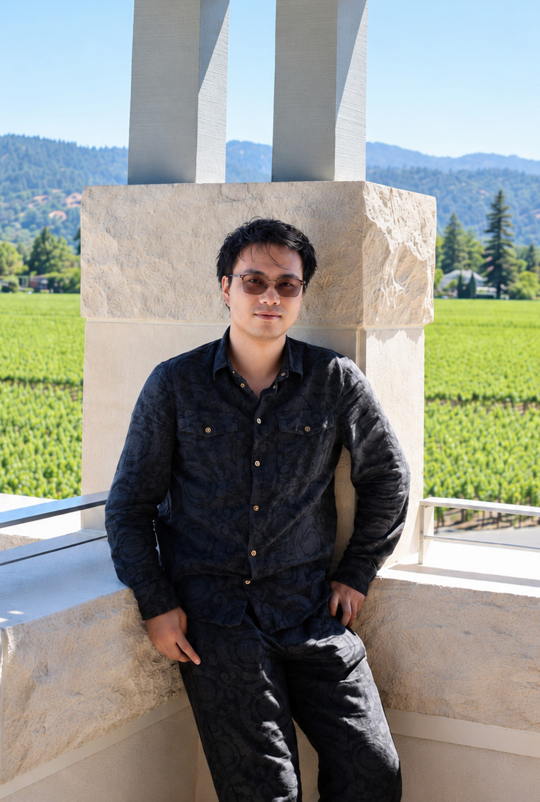

::: {.profile-container}

{fig-alt="A photo of Haoze Yan" width=220px fig-align="center"}

::: {.profile-text}

## About me

I am a Ph.D. candidate in the Department of Industrial Engineering and Operations Research at the University of California, Berkeley, advised by Prof. Thibaut Mastrolia. Previously, I received my B.S. with Honors in Mathematics from the University of Texas at Austin in 2023, where I worked under the supervision of Prof. Thaleia Zariphopoulou.

My research lies at the intersection of stochastic control, contract theory, and reinforcement learning, with a particular focus on financial and cyber systems involving risk, strategic behavior, and model uncertainty.

## Research interests

- Backward stochastic differential equations, including second-order BSDEs
- Hawkes processes and self-exciting stochastic systems
- Continous time reinforcement learning
- Cyber risk management and resilient cyber systems

## Current position

**Ph.D. Candidate**  
Department of Industrial Engineering and Operaions Research\
University of California, Berkeley

## Contact

Email: [haoze.yan[AT]berkeley[DOT]edu]

GitHub: [https://github.com/williamy9267](https://github.com/williamy9267)

Google Scholar: [Haoze Yan](https://scholar.google.com/citations?hl=en&user=kVu8tmgAAAAJ)

:::

:::